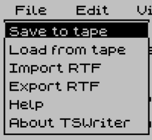
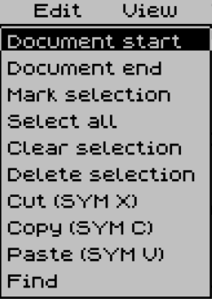
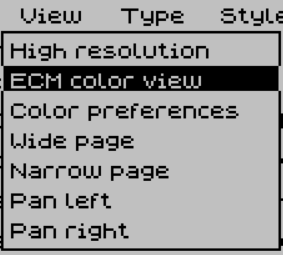
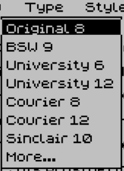
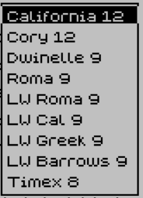
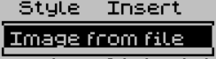
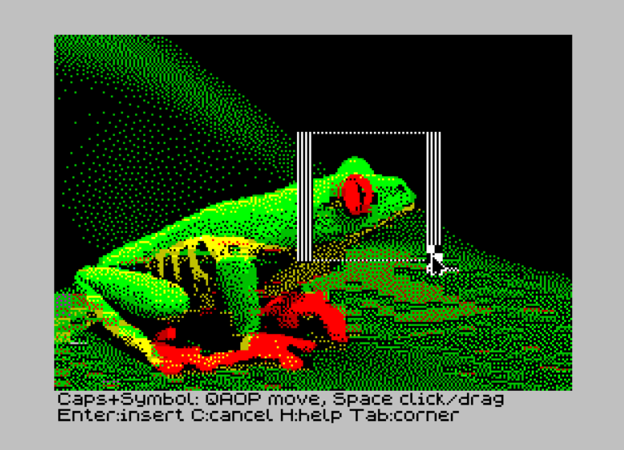

# TSWriter menu guide

This guide describes the current cartridge, with options in menu order. Menu names and option labels match the program. The native Save and Load labels still say “tape”; in Fuse, these operations use .tap files.

## Using the menus

Open a menu with the pointer or a keyboard shortcut, move through its options with the arrows, and press Enter to choose. Caps Shift + Space dismisses a menu. No dedicated Escape key is needed.

Symbol Shift + F, E, W, S or I opens File, Edit, View, Style or Insert. Both Shifts + T opens Type; both Shifts + V also opens View. “Both Shifts” means Caps Shift + Symbol Shift; Fuse’s Tab key holds both emulated Shift keys.

To operate the pointer on a real TS2068, hold both Shifts and use Q/A/O/P for up/down/left/right. Both Shifts + Space clicks; keep it held while moving to drag.

Selection is persistent: releasing Shift does not stop subsequent cursor movement from extending a selection. Use Caps Shift + Space or Edit → Clear selection to end it without deleting anything. Applying a font or style clears the selection after formatting it.

## File

### Save to tape

Saves a native TSWriter document, including its text, formatting, page width and embedded pictures. Use this format when you want to continue editing on the TS2068. It is different from an RTF export.

In Fuse, prepare a fresh virtual tape for the recording, choose this option, and press Enter at the prompt. The status changes to “Saving..” while TSWriter writes the document. Let the transfer finish, then use Fuse’s Tape → Write command to store the recording as a .tap file on the host computer. The TSWriter command alone does not create a host file. Keep a separate copy of important documents before replacing their saved files.

### Load from tape

Replaces the current document with a native TSWriter save. Open the document’s .tap file in Fuse and position it at the beginning, then choose this option. The initial prompt gives you time to prepare the input. Press Enter to begin; “Loading..” appears during the transfer. A successful load returns directly to the document without another Enter press.

Save your current work first if you want to keep it. Use Import RTF for a prepared RTF import instead; the two formats are not interchangeable. Space aborts an active transfer.

### Import RTF

Reads a prepared RTF stream and converts it into a native, editable document inside TSWriter. First use the website’s RTF → TAP tool to prepare a desktop .rtf file, review any compatibility changes, and download its import .tap file. Open that file in Fuse, choose Import RTF, and press Enter at the prompt.

The importer supports a limited set of text, font, style, color and paragraph alignment controls, plus supported pictures such as TSWriter’s own indexed PNG exports. It is not a complete desktop RTF reader: complex tables, footnotes and other picture encodings may need simplification. Desktop fonts and line wrapping can differ from the TS2068 display. Import replaces the current document, so save existing work beforehand.

### Export RTF

Writes an editable RTF export with text formatting and embedded pictures. Use a fresh virtual tape in Fuse, choose Export RTF, press Enter to start, and wait for completion. Save the recording with Fuse’s Tape → Write command, then open that .tap file in the website’s TAP → RTF extractor to download the .rtf file.

Install the matching desktop font package before opening the RTF in LibreOffice so its font family names can be resolved. Export is a desktop interchange operation; keep a native Save to tape copy for continued TSWriter editing. The extractor expects an RTF export recording, not a native document save.

### Help

Opens the built-in keyboard reference. It covers menus, cursor and page movement, selection, editing, undo and pointer controls. Press Enter to reach the second page, which explains image loading and cropping. Enter on that second page returns to the document. Caps Shift + Space closes either page.

### About TSWriter

Displays the program’s information, year and font acknowledgement. Press Enter to return to the document. This is an information screen, not an exit command.

## Edit

### Document start

Moves the cursor to the beginning of the document and brings that location into view. The keyboard equivalent is Symbol Shift + Left, or both Shifts + 5 on a physical TS2068. Clear an active selection first if you only want to navigate.

### Document end

Moves the cursor to the end of the document and brings it into view. Use Symbol Shift + Right, or both Shifts + 8 on hardware. Page movement is also available from the keyboard: Symbol Shift + Up/Down moves by ten layout lines, equivalent to both Shifts + 7/6.

### Mark selection

Starts a selection at the current cursor position. Move with the arrows to extend the range. This is particularly useful on a real TS2068 and avoids dependence on a host keyboard’s Shift-and-arrow behavior. Typing while text is selected replaces that selection.

### Select all

Selects the whole document. Use it before applying a document-wide font or style, copying all text, or deleting the document’s contents. Use Clear selection to leave the contents intact.

### Clear selection

Removes the highlight and exits selection mode without deleting the selected contents. Caps Shift + Space performs the same action from the document. This is the quickest way to stop a persistent selection before moving the cursor normally.

### Delete selection

Removes the selected contents. Unlike Cut, this does not put the deleted selection on the clipboard for pasting. Undo can restore an edit while its undo state remains available.

### Cut (SYM X)

Copies the selection to the internal clipboard and removes it from the document. Move to the destination and use Paste to insert it there. Symbol Shift + X, or both Shifts + X, is the keyboard command.

### Copy (SYM C)

Copies the selection to the internal clipboard while leaving the original contents in place. The menu label shows an older shortcut: the current keyboard command is both Shifts + C. Symbol Shift + C types a question mark.

### Paste (SYM V)

Inserts the internal clipboard contents at the current editing position, replacing a selection if one is active. The label shows an older shortcut: use Symbol Shift + Y or both Shifts + Y to paste. Symbol Shift + V types a slash. The internal clipboard is separate from the desktop operating system’s clipboard.

### Find

Opens a search prompt for up to 31 characters. Type a query and press Enter to search forward without regard to letter case. The search wraps around to the beginning and selects a match when found. It can match text across formatting changes, but does not join text across paragraphs or pictures.

To find the next occurrence, open Find again and press Enter to reuse the previous query. Typing a new query replaces the remembered one; Backspace edits it. If there is no match, the prompt remains available for another query. Caps Shift + Space cancels. Clear the resulting selection before typing if you do not intend to replace the match.

### Undo keyboard command

Undo is available with both Shifts + Z, although it has no separate Edit menu item. There are up to five undo states. Continuous typing is grouped into an undo action, with a pause of about one second ending the group. Undo shares the document’s memory pool, so older states are discarded as space fills; five states are not guaranteed for every document size.

## View

### High resolution

Uses the TS2068’s 512 × 192 display for finer horizontal detail. Text and pictures use a global ink/paper pair rather than independent text colors. Picture tones are represented with monochrome patterns. Stored text colors are retained for ECM display and RTF export.

### ECM color view

Timex Extended Color Mode (ECM) displays 256 × 192 pixels with 8×1-pixel color attribute resolution: each horizontal strip of eight pixels has its own ink and paper colors. Standard SCR screens use 8×8-pixel attribute blocks, so ECM allows finer color detail while keeping two colors within each strip. This shows individual text colors and supported picture colors. A wide document is wider than the visible ECM area, so horizontal panning is available. Switching the display mode does not itself change the document’s page width.

### Color preferences

Opens display preferences for the current session. These settings control the screen appearance; use Style → Text color... to assign colors to document text.

- High res: ink / paper + border chooses the global high-resolution ink color and its complementary paper/border color.
- ECM ink sets the default text ink used by the ECM display.
- ECM paper sets the ECM background color.
- ECM brightness selects normal or bright display attributes.
- ECM border selects one of the eight border colors. ECM brightness does not make the hardware border bright white.

Use Up/Down to choose a row and Left/Right to change its value, or select the swatches with the pointer. Enter applies the choices. Caps Shift + Space cancels. Display preferences are separate from the formatting saved with a document.

### Wide page

Sets a 512-pixel logical page width and reflows the document to that width. High resolution can display the wide page; ECM shows a horizontal portion of it. Page width is document formatting, so changing it can change wrapping and the cursor’s layout line number.

### Narrow page

Sets a 256-pixel logical page width and reflows text to fit. This fits the ECM viewport without horizontal panning. It remains a narrow page if you switch back to high resolution.

### Pan left

Moves the viewport left across a wide page in ECM mode, in 64-pixel steps. Both Shifts + H is the keyboard command. Panning changes the view, not the document’s page width or text alignment. Narrow pages do not pan.

### Pan right

Moves the viewport right across a wide ECM page, in 64-pixel steps. Both Shifts + L is the keyboard command. Use the opposite pan command to return toward the left edge.

## Type

Chooses the typeface for selected text or for newly typed text when there is no selection. Applying a font to a selection clears the highlight afterward. These are fixed native font sizes; there is no arbitrary size-entry dialog.

### First font page

- Original 8: the original compact TSWriter face, with proportional character spacing.
- BSW 9: the BSW native font.
- University 6: the smaller University font.
- University 12: the larger University font.
- Courier 8: the smaller Courier font.
- Courier 12: the larger Courier font.
- Sinclair 10: the Sinclair display face.
- More...: opens the additional font choices below; it does not apply a font itself.

### More... font page

- California 12
- Cory 12
- Dwinelle 9
- Roma 9
- LW Roma 9
- LW Cal 9
- LW Greek 9
- LW Barrows 9
- Timex 8

Each entry selects that native face. Timex 8 is the separate fixed-width original Timex system font; unlike Original 8, it preserves the eight-pixel character cell. LW Greek uses the native font’s character mapping rather than providing general Unicode text entry.

The desktop font package supplies matching family names for RTF use. Most desktop faces are outline approximations of these small native fonts; the Timex companion deliberately preserves the pixel-shaped appearance. Desktop letter widths and resulting line breaks can differ.

## Style

Character styles and text colors apply to the selection, or to subsequent typing when nothing is selected. Paragraph alignment controls the paragraph rather than just the selected letters. Formatting a selection removes its highlight afterward so the result is immediately visible.

### Plain

Clears bold, italic and underline to restore plain lettering. It does not choose a different typeface.

### Bold (toggle)

Turns bold lettering on or off. Use it to emphasize selected words or set the style for new text.

### Italic (toggle)

Turns slanted lettering on or off. It can be combined with bold and underline.

### Underline (toggle)

Turns underlining on or off, independently of bold and italic.

### Align left

Aligns the paragraph at the left margin, leaving the right edge ragged. For an image, left alignment allows following text to flow to its right when there is enough room.

### Align center

Centers paragraph lines within their available width. A centered image occupies its own block, with following text below it.

### Align right

Aligns paragraph lines at the right margin. A right-aligned image can have following text flowing to its left when space permits.

### Justify

Spreads the spaces between words so wrapped paragraph lines reach both margins. The last line of the paragraph remains left aligned. This is paragraph alignment, not a different font or a command to insert literal spaces into the text.

### Text color...

Opens the choices Default, Black, Blue, Red, Magenta, Green, Cyan, Yellow and White. Choose a color for the selected text or subsequent typing. Default follows the display’s default ink setting. The selection clears after applying the color.

Individual colors are visible in ECM and included in RTF interchange. High resolution uses its global ink/paper pair, so differently colored text does not appear as independent colors or shades there. Color preferences in View changes the display defaults rather than recoloring a selected passage.

## Insert

### Image from file

Loads a supported screen image from a .tap file and opens a crop preview before insertion. Supported sources are standard SCR and ECM screen images, not arbitrary desktop JPEG or PNG files. Prepare the screen image in the appropriate .tap format, open it in Fuse, and position the input before choosing this option.

Use [Retro Pixel Converter](https://factus10.github.io/retro-pixel-converter/) to generate ECM or SCR screen files from desktop images. Choose Timex Extended Color for ECM or a standard Spectrum/Timex mode for SCR. [ECMView](https://www.timexsinclair.com/computer_media/ecmview/) is a separate TS2068 viewer for ECM images; it also offers a TSPico viewer/slideshow option. Its archive includes a number of sample Extended Color Mode images that can be imported into TSWriter.

At the loading prompt, Enter begins and C cancels; Space aborts an active transfer. Once loaded, the crop rectangle initially covers the full image. The preview has these controls:

- Arrows move the crop rectangle in eight-pixel steps.
- Hold Shift first, then an arrow, to resize the active corner.
- Press both Shifts alone and release to switch the active corner; in Fuse, tap Tab.
- Hold both Shifts with Q/A/O/P to move the pointer. Add Space to click or drag.
- H shows or hides the crop instructions.
- Enter inserts the crop into the document.
- C or Caps Shift + Space cancels the crop preview without inserting it.

Choose the part of the image to insert, then press Enter, or C to cancel.

If the crop is too large for the available memory, shrink it or cancel. Text, image data and undo history share a 30 KB pool, so pictures reduce the space available for further editing.

Use Style alignment to position the inserted image. Left- and right-aligned pictures allow following text beside them when sufficient width remains; centered pictures place following text underneath. High resolution renders picture tones monochromatically, while ECM retains supported colors.
